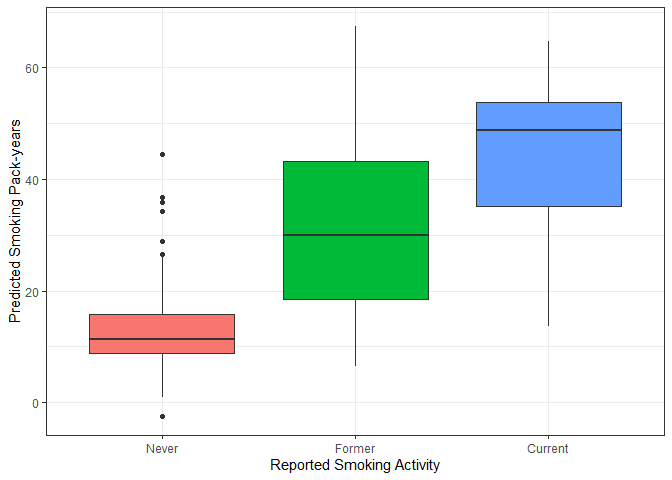
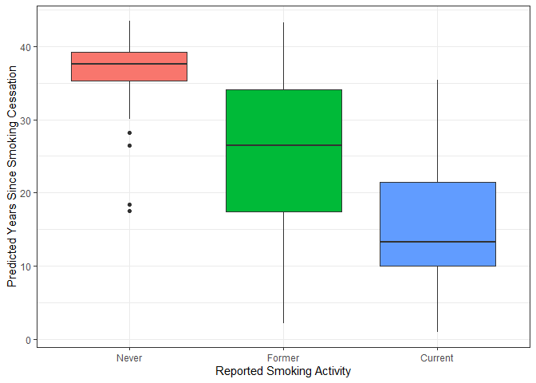

[WHI_Predictors_Guide.md](https://github.com/user-attachments/files/26311302/WHI_Predictors_Guide.md)
WHI DNAm Smoking Predictors
================

Application functions for the use of DNA methylation-based predictors of
smoking activity developed within the Women’s Health Initiative, as
described in **citation**  
Please cite the manuscript accordingly when using.

# Usage of the WHI Smoking Predictors

The input is a DNA methylation matrix with CpGs as row and samples as
columns.

``` r
library(tidyverse)
source("WHI_Predictors.R") # update with github version once public ############################

load("./results/GSE50660_dat_example.RData")
# Input is a DNAm matrix with CpGs as rows, samples as columns
meth[1:5, 1:5] 
```

    ##            GSM1225377 GSM1225378 GSM1225379 GSM1225380 GSM1225381
    ## cg00018524    0.08387    0.07872    0.09947    0.10325    0.08275
    ## cg00035347    0.67386    0.64858    0.67740    0.66294    0.66496
    ## cg00045910    0.46879    0.41520    0.53900    0.54013    0.50665
    ## cg00078085    0.08170    0.08971    0.10830    0.11198    0.10030
    ## cg00087884    0.28613    0.22864    0.29184    0.31150    0.29029

Smoking status prediction is accomplished with the *smoke_status()*
function.  
Missing CpGs are imputed with mean imputation.  
Optional specifications include ‘predictors’ (default setting is to
estimate the “packyears”, “cessation”, and “SMOKE_3cat” predictors) and
array. The WHI DNAm smoking predictors were generated using the EPICv2
array, and the prediction function assumes data is in EPICv2 format (eg.
probe names formatted as cg25324105_BC11 rather than cg25324105). If
using older arrays (“450K”, “EPICv1”), specify this with the optional
array argument, as in the example below.

``` r
preds <- smoke_status(meth, array = "450K")
```

The output is a data frame with 4 columns; SampleID matching order
present in meth, packyears, cessation, and SMOKE_3cat.

``` r
head(preds)
```

    ##     SampleID packyears cessation SMOKE_3cat
    ## 1 GSM1225377 40.422148  19.99730          1
    ## 2 GSM1225378  7.798427  34.93526          0
    ## 3 GSM1225379 24.895674  26.94060          1
    ## 4 GSM1225380 38.840200  20.95809          1
    ## 5 GSM1225381 35.432463  19.45278          1
    ## 6 GSM1225382 44.607847  19.07735          1

``` r
# join with phenotype file containing reported smoking activity
pheno <- cbind(pheno, preds)
```

### 3-category Smoking Status Predictor

Smoking status is encoded as: 0 = never, 1 = former, 2 = current

``` r
table(Reported = pheno$SMOKE, Predicted = pheno$SMOKE_3cat)
```

    ##         Predicted
    ## Reported   0   1   2
    ##        0 158  21   0
    ##        1  66 155  42
    ##        2   2   7  13

### Pack-years Predictor

Distribution of smoking pack-years among never, former, and current
smokers.

``` r
ggplot(pheno, aes(x = SMOKE, y = packyears, fill = SMOKE)) + 
  geom_boxplot() + theme_bw() + theme(legend.position = "none") + 
  xlab("Reported Smoking Activity") + 
  ylab("Predicted Smoking Pack-years") + 
  scale_x_discrete(labels = c("Never", "Former", "Current"))
```

<!-- -->

### Years Since Smoking Cessation Predictor

Distribution of years since cessation among never, former, and current
smokers.

``` r
ggplot(pheno, aes(x = SMOKE, y = cessation, fill = SMOKE)) + 
  geom_boxplot() + theme_bw() + theme(legend.position = "none") + 
  xlab("Reported Smoking Activity") + 
  ylab("Predicted Years Since Smoking Cessation") + 
  scale_x_discrete(labels = c("Never", "Former", "Current"))
```

<!-- -->
